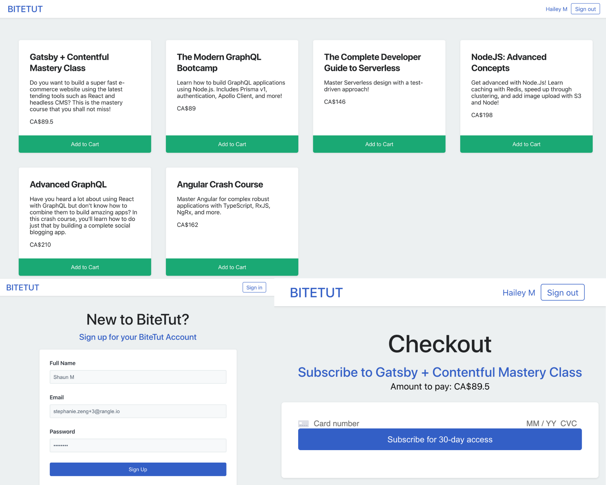
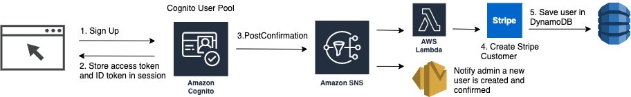
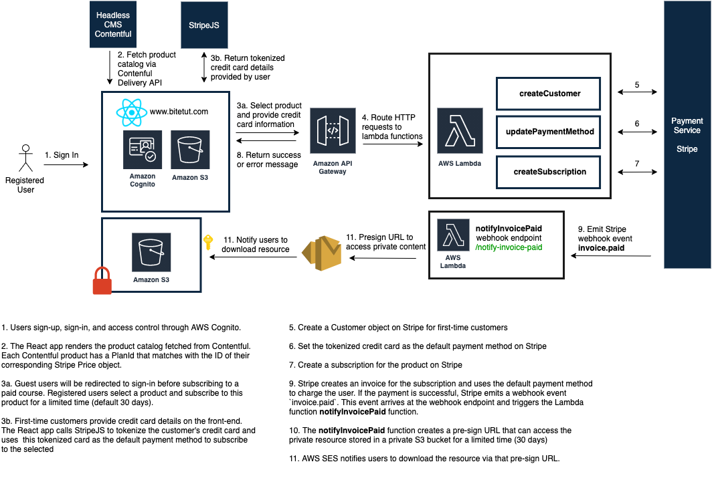

# **BiteTut - Headless Serverless E-commerce POC**

BiteTut is a serverless e-commerce storefront that provides subscription-based online learning content managed by headless CMS.

## **Features**

- Create, manage and publish content with [Contentful](https://www.contentful.com/)
- Manage recurring payments using [Stripe](https://stripe.com)
- Secure user authentication and access control using [AWS Cognito](https://aws.amazon.com/cognito/)
- Highly customizable components with full theming support using [styled-components](https://styled-components.com/docs/advanced#theming)
- Deploy and manage AWS infrastructure to use AWS Lambda functions with the [Serverless Framework](https://www.serverless.com/)

## Overview

This project consists of a ReactJS front-end and a serverless back-end using AWS Lambda. The following AWS services are also used in this project:

- S3: a public S3 bucket to host the React web app and a private S3 bucket to store private content
- Simple Email Service (SES): notify customers with the pre-sign URL of the private content
- Cognito: user sign-in and access control
- Simple Notification Service (SNS): save user information to DynamoDB when a user is created in the Cognito user pool
- DynamoDB: store user account information (e.g. user email and their Stripe customer ID)

React app screenshots



### User Sign Up Flow



### User Purchase Flow



## Prerequisites

### Contentful Account

1. Sign up for a Contentful account
2. Create an empty Space to hold your content
3. Set up content model
4. Configure the [Contentful Javascript SDK](https://github.com/contentful/contentful.js/#configuration) using your set of the access token and space ID

### Stripe account

1. Sign up for a Stripe account
2. Obtain the [Stripe API keys](https://stripe.com/docs/keys)

### AWS account

1. Sign up for an AWS account
2. Create an IAM User and Access Key
3. Set up credential [with AWS CLI](https://github.com/serverless/serverless/blob/master/docs/providers/aws/guide/credentials.md#setup-with-the-aws-cli)

## Get Started

Follow the following steps to run the React application and the serverless backend locally.

```bash
git clone https://github.com/rangle/serverless-app-poc.git
```

- Update placeholder credentials listed in the `.env.example` file, and rename this file to `.env`
- Install dependencies for the project

```bash
cd frontend

# install dependencies for the React application
yarn install

# run the application locally
yarn start

cd backend

# install dependencies for the serverless application
yarn install

# run lambda functions offline
yarn dev
```

## Folder Structure

```
.
├── frontend                    # ReactJS application
│   ├── src
│   │   ├── components          # styled-components
│   │   ├── content             # content service, contentful config
│   │   ├── payment             # payment service with Stripe
│   │   ├── auth                # auth service with Cognito, auth context
│   │   ├── theme               # theme config for styled-components
│   │   └── ...
│   └── ...
├── backend                     # Serverless backend
│   ├── src                     # lambda functions
│   └── serverless.yml          # defines AWS infrastructure resources
└── README.md
```
